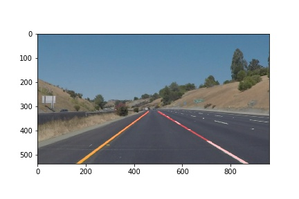

# **Finding Lane Lines on the Road** 

**Finding Lane Lines on the Road**

The goals / steps of this project are the following:
* Make a pipeline that finds lane lines on the road
* Reflect on your work in a written report

[//]: # (Image References)

[image1]: ./examples/grayscale.jpg "Grayscale"

---

### Reflection

### 1. Pipeline
The goal of this project was to 1) find lane-marker segments using opencv-detected edges and a hough transform and 2) consilidate the segments into stable lane delimiters. 
#### Lane segments
The opencv approach brings with it a multi-step pipeline with multiple parameters for each step. The steps here consisted of I) turning the image into gray-scale, II) applying a Gaussian blur, III) finding edges using a canny transform, and IV) filtering the edges with a region-of-interest, and V) finding line segments through a Hough transform.
The grayscale was chosen here for simplicity and availability of the powerful `canny` function for grayscale images in opencv. Using grayscale, we ignore transitions from 'bright blue' to 'bright red' and only are sensitive to transitions from bright to dark. For safety reasons, lane markers are designed as bright yellow or white on a dark asphalt road. As such, grayscale processing is perfectly suited for our problem.
The Gaussian blur was used with a kernel size of 5. It's purpose is to reduce noise in the image which might falsely trigger the edge detection. We varied the kernel size to values of 1,3,5, and 7. The choice of 5 was obtained by optimizing iteratively together with the canny parameters and the Hough transform for found lane segments.
For the canny transform, variations of the high and low threshold were tried out. We aimed for keeping many detected edges of the current-lane markers while limiting the number of edges found for other parts in the six test images in the "test_images/" folder. Besides the current-lane markers, edges were found for other lanes, the transition from asphalt road to grass periphery, and vegation to sky. There is a clear ordering in slope from vertical (no edges) via diagonal (current-lane markers), and near-horizontal (other lanes, asphalt to peripheriy) to horizontal (vegetation to sky).
As a next step, we used a region of interest (ROI) approach to filter out most of the near-horizontal and horizontal egdes. None of the unwated edges intersect with the abscissa in the displayed range. We use a trapezoidal ROI `(0,height),(0.45*width,0.58*height),(0.55*width,0.58*height),(width,height)` to be mostly left with edges of the lane markers of interest.
The Hough transform to find lines, i.e. first order polynomials, was optimized to find longish line segments by requiring at least 180 pixels of line length at an image height of only 540 pixels and the visible road section being limited to half of the height of the image. This rather strict requirement was balanced by allowing long gaps of up to 150 pixels between edges. 

#### Consilidating line segments - draw_lines()
The Hough transform provides the possibility to specify a coarser resolution in rho and theta, the distance and the angle resolution. However, we were not able to achieve consolidated line demarkations using the Hough transform alone. Instead the Hough transform typically provided us multiple line segements for a line marker; usually the one line segment was found for the transition from dark asphalt to bright lane marker and another segment was found for the transition from bright lane marker to dark asphalt. The consolidation was performed in the draw lines. As suggested, each line segment was classified to belong either to the left or right lane marker by sorting it according to its slope (y2-y1)/(x2-x1). The left and right segments were then averaged with the np.polyfit package using the two (start and end) points for each line segment. The resulting averaged line parameters were drawn ("extrapolated") over the lower 40% of the image.

### 2. Shortcomings of the current pipeline
A clear shortcoming of the current pipeline is that it only works on straight lines. This can be clearly seen when applying it to the challenge video with the curved lane. 
Furthermore, we can observe that while the lanes are perfectly found in all six test images, the two videos exhibit single frames without found lane markings. 

### 3. Possible improvements to the pipeline
The curved lanes could be found by applying a second order polynomial in the hough transform line search or finding straight pieces of short lane markers and combining them with a higher order function.
To ensure lanes are not just found in the current about 90% of the video frames but really in all frames, we should go back to the parameters of the canny and Hough algorithms and lower the thresholds. We currently did not observe spurious extra lines, so lowering the detection threshold definitely seems feasible.
